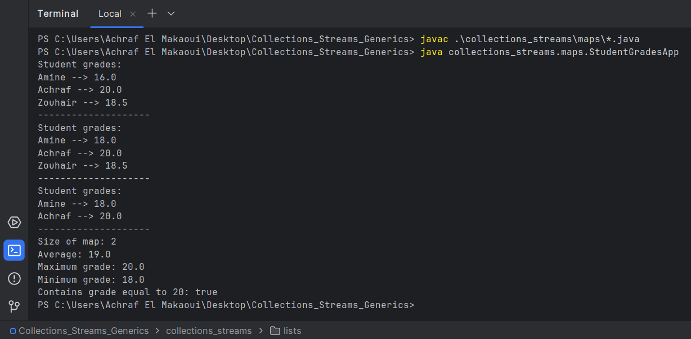
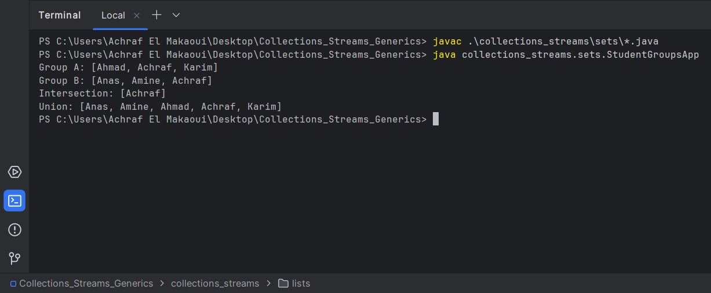
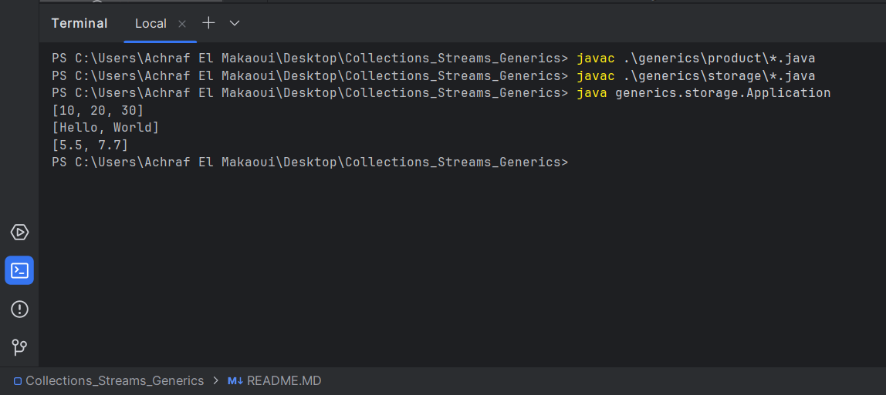
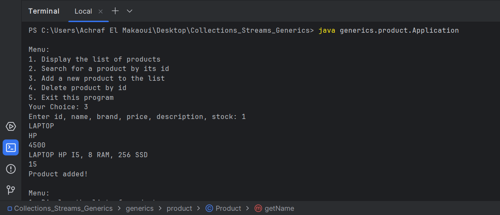
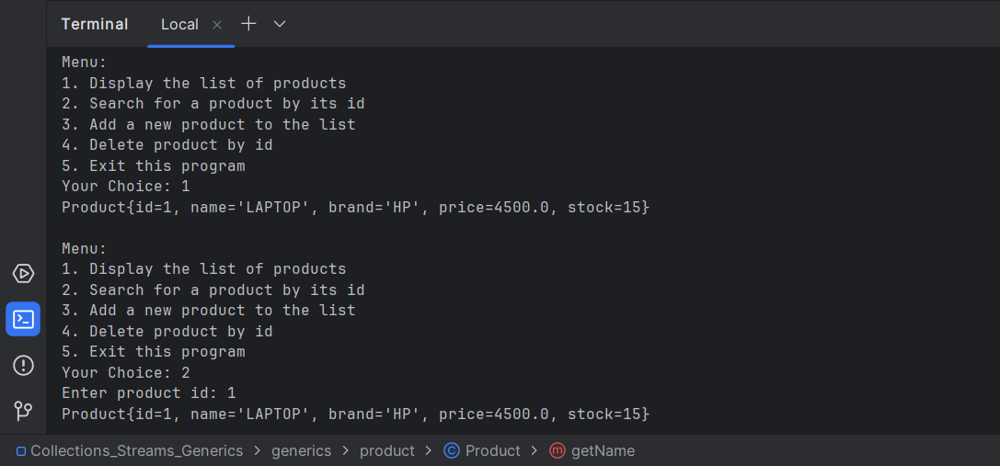
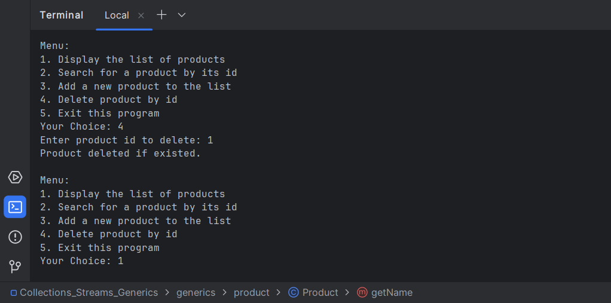

# Java Collections & Generics 

This repository contains practical exercises for the **OOP in Java** course.  
The goal is to practice **Collections, Streams, and Generics** through simple console applications.

---

## 1. Collections & Streams

### Lists – Product Management

#### Problem
Create a Java application to manage a list of products using an `ArrayList`.  
Each product has an **id**, **name**, and **price**.  
The application must allow adding, deleting, modifying, displaying, and searching products.

#### Solution
- Created a `Product` class to represent a product.
- Used an `ArrayList<Product>` to store products.
- Implemented all required operations inside the `main` method.

#### Execution

---

### Maps – Student Grades Management

#### Problem
Create a `HashMap` where:
- Key: student name (`String`)
- Value: grade (`Double`)

Perform operations such as inserting, updating, deleting grades, and calculating statistics.

#### Solution
- Used `HashMap<String, Double>`.
- Applied `forEach` with lambda expressions for display.
- Calculated **average**, **minimum**, and **maximum** grades.
- Checked if a grade equal to **20** exists.

#### Execution

---

### Sets – Student Groups

#### Problem
Create two groups of students using `HashSet`:
- Group A
- Group B

Display the **intersection** and **union** of the two groups.

#### Solution
- Used `HashSet<String>` for each group.
- Applied `retainAll()` for intersection.
- Applied `addAll()` for union.

#### Execution

---

## 2. Generics

### GenericStorage – Generic Class

#### Problem
Create a generic class that can store elements of **any type** and perform basic operations.

#### Solution
- Created a generic class `GenericStorage<T>`.
- Implemented methods for add, remove, retrieve, and size.
- Tested the class using `Integer`, `String`, and `Double`.

#### Execution

---

### Generic Product Management (IMetier)

#### Problem
Use **generics and interfaces** to manage a collection of products with CRUD operations.

#### Solution
- Created a `Product` class with full attributes.
- Created a generic interface `IMetier<T>`.
- Implemented the interface in `MetierProduitImpl`.
- Built a menu-driven console application.

#### Execution

---

